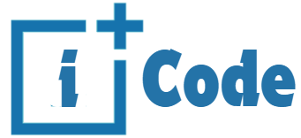

vivekvohra.github.io

# iPlus-Code
iPlus Code is an interactive personal Blog platform Here the author share his thoughts and experiences about tech. iPlus Code is a platform where he can connect with like-minded individuals and express hiself freely.
# Link : 
# This site is made as an assigment for CS50x
It is a project under week-8 Pset Homepage. It uses HTML, CSS, JavaScript languages with Bootstrap framework.. Bootstrap is a popular library (that comes with lots of CSS classes and more) via which you can beautify your site.The site is made to be responsive i.e. The site looks nice on browsers both on mobile devices as well as laptops and desktops.
# Specification for the website as it must fulfill the following conditions:
★ Contain at least four different .html pages, at least one of which is index.html , and it should be possible to get from any page on your website to any other page by following one or more hyperlinks.

★ Use at least ten distinct HTML tags

★ Have at least one stylesheet file of your own creation, styles.css, which uses at least five (5) different CSS selectors

★ Integrate JavaScript into your site to make your site more interactive.

